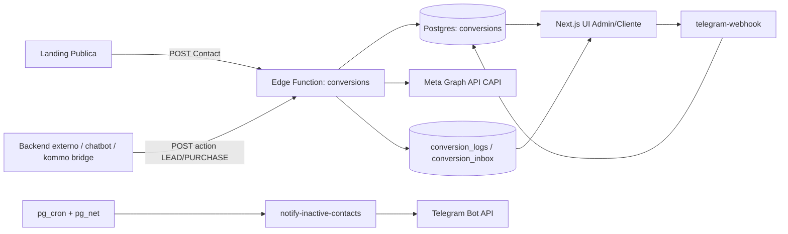
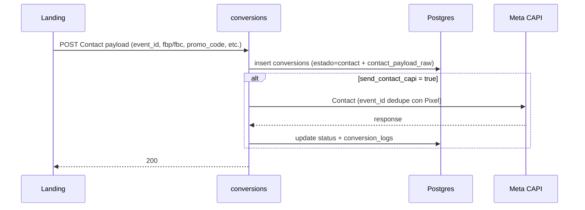
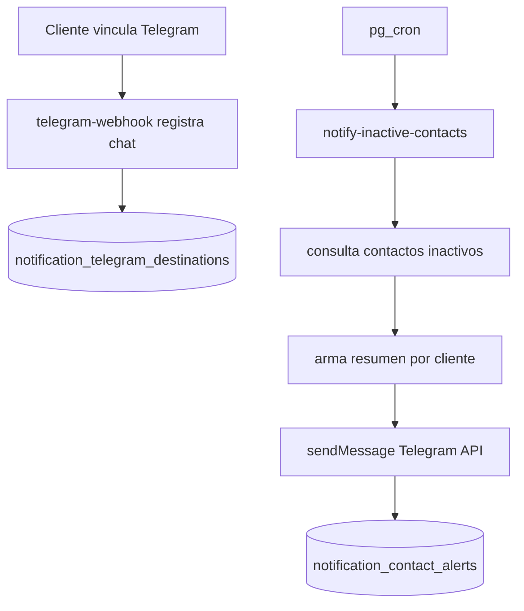

# Landing Builder v2

Plataforma multi-tenant para:
- Crear/gestionar landings.
- Capturar conversiones (`Contact`, `Lead`, `Purchase`) con trazabilidad completa.
- Enviar eventos a Meta CAPI con deduplicacion Pixel+CAPI.
- Operar seguimiento comercial y notificaciones de inactividad por Telegram.

Stack principal:
- Frontend: Next.js (`frontend/`)
- Backend/serverless: Supabase Edge Functions (`supabase/functions/`)
- DB: Postgres/Supabase + migraciones (`supabase/migrations/`)
- Infra operativa: `pg_cron` + `pg_net` + Vercel

---

## 1. Objetivo del proyecto

El sistema centraliza el funnel de conversiones de multiples clientes (admin + clientes finales):
- Cada cliente tiene su configuracion de conversiones y columnas visibles.
- El flujo soporta landings internas del constructor y landings externas conectadas.
- Se mantiene historial de eventos, logs tecnicos y payloads raw para auditoria/debug.

No se limita a reporting: tambien ejecuta logica operativa (dedupe, retries, notificaciones, sincronizacion de telefonos, webhook Telegram).

---

## 2. Mapa funcional (A -> Z)

### 2.1 Captura
- **Contact**: llega desde la landing publica al endpoint `conversions`.
- **Lead/Purchase**: llegan por JSON desde backend externo/chatbot/kommo-intermediarios.

### 2.2 Persistencia
- Se guarda cada conversion en `public.conversions`.
- Se guardan payloads raw por tipo:
  - `contact_payload_raw`
  - `lead_payload_raw`
  - `purchase_payload_raw`

### 2.3 Envio Meta CAPI
- El backend construye payload CAPI.
- Normaliza parametros (`fbp/fbc`, email, phone, nombre, geo, etc.).
- Hashea campos que corresponden.
- Envia a Graph API y registra respuesta/log.

### 2.4 UI operativa
- **CONVERSIONES**: Funnel, Tabla, Estadisticas, Configuracion, Logs.
- **SEGUIMIENTO**: ranking operativo por jugador (ultima actividad, cargas, promedio, total).
- **NOTIFICACIONES**: Telegram + reglas de inactividad.

### 2.5 Automatizaciones
- Cron de reintento de conversiones fallidas.
- Cron de notificaciones por inactividad.
- Cron de sincronizacion/precarga de telefonos para landings.

---

## 3. Arquitectura de alto nivel



---

## 4. Estructura del repo

- `frontend/`
  - App Next.js (admin/cliente), dashboards, tablas, tabs y componentes.
- `supabase/functions/`
  - Edge Functions de negocio y operacion.
- `supabase/migrations/`
  - Evolucion del esquema SQL.
- `scripts/`
  - Utilidades de encoding/hooks.
- `docs/`
  - Documentacion adicional.

Funciones clave en `supabase/functions/`:
- `conversions`
- `retry-failed-conversions`
- `notify-inactive-contacts`
- `telegram-webhook`
- `configure-telegram-webhook`
- `create-client`, `update-client`, `delete-client`, `list-clients`
- `landing-phone`, `sync-phones`, `phone-click`, `reset-phone-counters`

---

## 5. Modelo de datos (resumen)

Tablas principales:
- `conversions`: eventos/filas de conversion por cliente.
- `conversions_config`: config por cliente (Meta, columnas visibles, logs, umbrales).
- `conversions_pixel_configs`: configuraciones Meta CAPI por pixel (multi-pixel por cliente).
- `conversion_logs`: log tecnico y respuesta Meta.
- `conversion_inbox`: dedupe de `action_event_id` y trazabilidad de eventos entrantes.
- `notification_settings`: reglas de notificacion.
- `notification_telegram_destinations`: destinos Telegram vinculados por cliente.
- `notification_contact_alerts`: control de re-notificacion por contacto.
- `profiles`, `landings`, `gerencias`, `gerencia_phones` y relacionadas.

Campos de trazabilidad en `conversions`:
- `contact_payload_raw`
- `lead_payload_raw`
- `purchase_payload_raw`

Estos campos guardan el JSON original recibido, sin perder contexto de origen.

---

## 6. Flujos de conversion (detallado)

### 6.1 Contact



### 6.2 Lead (`action: LEAD`)
- Match principal: `promo_code`.
- Fallback (segun version/config): `phone` si aplica.
- Guarda `lead_payload_raw`.
- Actualiza/crea fila y envia `Lead` CAPI.

### 6.3 Purchase (`action: PURCHASE`)
- Match principal: `promo_code`.
- Fallback: `phone`.
- Primera compra: `purchase_type=first`.
- Recompra: nueva fila heredando identidad relevante (`purchase_type=repeat`).
- Guarda `purchase_payload_raw`.
- Envia `Purchase` CAPI con `custom_data` (`value`, `currency`, `purchase_type` cuando corresponde).

### 6.4 Dedupe de eventos entrantes por `action_event_id`
- Si llega `action_event_id` y ya fue procesado:
  - se ignora el duplicado,
  - se responde sin reprocesar,
- queda trazabilidad en inbox/log.

---

## 7. Multi-pixel (implementacion actual)

### 7.1 Objetivo
Permitir que **un mismo cliente** tenga **uno o mas pixeles Meta** y que cada evento CAPI salga por el pixel correcto segun la conversion.

### 7.2 Tabla de configuracion
- `public.conversions_pixel_configs`
  - `user_id`
  - `pixel_id`
  - `meta_access_token`
  - `meta_currency`
  - `meta_api_version`
  - `is_default`

Reglas:
- Unicidad por cliente+pixel (`user_id`, `pixel_id`).
- Un unico pixel `default` por cliente.
- Backfill automatico desde `conversions_config` (legacy) al crear la estructura multi-pixel.

### 7.3 Resolucion de pixel/token al enviar CAPI
Para cada envio (`Contact`, `Lead`, `Purchase`) el backend resuelve asi:
1. Pixel de la fila de conversion (`conversions.pixel_id`) si existe y esta configurado en `conversions_pixel_configs`.
2. Si no encuentra match, usa el pixel marcado como `is_default=true`.
3. Fallback final a `conversions_config` (compatibilidad retroactiva).

Esto se aplica tanto en:
- `supabase/functions/conversions`
- `supabase/functions/retry-failed-conversions`

### 7.4 Trazabilidad
- `conversions.pixel_id` (columna de tabla/UI) permite auditar por que pixel se proceso el evento.
- `conversion_logs` guarda payload/respuesta Meta para diagnostico por evento.

### 7.5 Compatibilidad
- No rompe clientes viejos: si solo existe config legacy, sigue funcionando.
- Si la landing manda `pixel_id` en Contact, ese valor queda atado a la conversion para envios posteriores.

---

## 8. Envio a Meta CAPI (compatibilidad y buenas practicas)

La logica actual:
1. Recibe payload.
2. Normaliza parametros CAPI.
3. Hashea campos requeridos.
4. Envia a Meta.

Normalizacion aplicada antes de hash/envio:
- `email`, `phone`, `fn`, `ln`, `external_id`
- `ct`, `st`, `zip`, `country`
- `fbp`, `fbc` (formato Meta)

Notas:
- `fbp`/`fbc` no se hashean.
- Si un valor no cumple formato esperado, se limpia o se omite para evitar ruido.
- Se mantiene dedupe Pixel + CAPI con `event_id` en Contact.

---

## 9. Dashboard de Conversiones

Tabs principales:
- `Funnel`
- `Tabla`
- `Estadisticas`
- `Configuracion`
- `Logs` (si habilitado)

### 9.1 Tabla
- Muestra filas de `conversions`.
- Soporta columnas configurables por cliente/admin.
- Incluye payloads raw (`contact/lead/purchase`) para trazabilidad.

### 9.2 Logs
- Muestra entradas de `conversion_logs`.
- Incluye payload enviado a Meta y respuesta recibida (cuando aplica).

### 9.3 Estadisticas
- Filtro de fecha.
- Filtro por landing (visualizacion, no altera datos).
- Excluye filas de prueba (`test_event_code`) donde corresponda.

---

## 10. Seguimiento

Vista operativa para contacto de jugadores:
- Ranking configurable por reglas (indicador por total cargado).
- Ultima vez activo.
- Cargas, carga promedio, total cargado.
- Integracion directa a WhatsApp para seguimiento.
- Paginacion y busqueda para rendimiento/operatividad.

---

## 11. Notificaciones Telegram

Componentes:
- Configuracion de canal y reglas de envio.
- Vinculacion de chat(es) por webhook de Telegram.
- Envio de resumen agrupado de contactos inactivos.

Reglas:
- Umbral de inactividad (`inactive_days`).
- Re-notificacion (`renotify_days`).
- Hora de envio (zona Buenos Aires).

Flujo:



---

## 12. Landings internas y externas

Tipos:
- `interna`: renderizada/gestionada completamente por el constructor.
- `externa (conectada)`: frontend propio de tercero, pero usa utilidades del constructor.

Para landing externa:
- Usa endpoint de conversiones del constructor.
- Debe enviar payload compatible (event_id, external_id, promo_code, fbp/fbc, etc.).
- Debe integrar obtencion de telefono (`landing-phone`) si usa rotacion/asignacion.

---

## 13. Operacion, cron y retries

Automatizaciones principales:
- `retry-failed-conversions`: reintenta envios CAPI fallidos.
- `sync-phones`: sincroniza/actualiza disponibilidad de telefonos.
- `notify-inactive-contacts`: envio de resumentes Telegram.
- `warm-landing-phone`: precalentamiento de telefonos por cron.

Recomendacion:
- Revisar periodicamente `cron.job` y `cron.job_run_details`.
- Verificar `net._http_response` para diagnostico de llamadas cron->functions.

---

## 14. Setup local

### 13.1 Frontend
```bash
cd frontend
npm install
npm run dev
```

`frontend/.env.local` minimo:
- `NEXT_PUBLIC_SUPABASE_URL`
- `NEXT_PUBLIC_SUPABASE_ANON_KEY`

### 13.2 Supabase CLI
```bash
supabase --version
supabase db push
supabase functions deploy conversions
supabase functions deploy retry-failed-conversions
```

---

## 15. Deploy

- Frontend: Vercel (`main`).
- Backend: Supabase Edge Functions.
- DB: migraciones SQL via `supabase db push`.

Checklist de release:
1. `git status` limpio.
2. Migraciones aplicadas.
3. Funciones desplegadas tocadas en el cambio.
4. Smoke tests de `Contact`, `LEAD`, `PURCHASE`.
5. Verificacion en `conversion_logs` y Meta Events Manager.

---

## 16. Calidad y seguridad de texto (anti-mojibake)

Incluye:
- `.editorconfig` (`charset=utf-8`)
- `.gitattributes` (`text=auto eol=lf`)
- `scripts/check-encoding.js`
- hooks locales (`.githooks`)
- CI workflow de encoding

Instalacion hooks:
```bash
powershell -ExecutionPolicy Bypass -File scripts/install-git-hooks.ps1
```
o
```bash
sh scripts/install-git-hooks.sh
```

---

## 17. Troubleshooting rapido

- **No llega evento a Meta**:
  - revisar `conversion_logs` (`payload_meta`, `response_meta`)
  - validar configuracion en `conversions_pixel_configs` (y fallback legacy `conversions_config`)
  - validar que `conversions.pixel_id` tenga match con un pixel configurado
  - revisar status HTTP en logs

- **No llegan notificaciones Telegram**:
  - validar `notification_settings.enabled`
  - validar destinos activos en `notification_telegram_destinations`
  - revisar corridas cron y `net._http_response`

- **Descuadre de metricas**:
  - revisar dedupe (`event_id` Contact y `action_event_id` en inbox)
  - revisar payloads raw en tabla (`contact/lead/purchase_payload_raw`)

---

## 18. Documentacion complementaria

- [frontend/README.md](frontend/README.md)
- [CRON-SETUP.md](CRON-SETUP.md)
- [supabase/migrations/README.md](supabase/migrations/README.md)
- [docs/META_CAPI_PAYLOAD.md](docs/META_CAPI_PAYLOAD.md)

---

## 19. Estado actual

El proyecto esta preparado para:
- Operacion multi-cliente.
- Operacion multi-pixel por cliente, con seleccion de pixel por evento.
- Trazabilidad completa de conversiones.
- Robustez de ingestion + retries + logs.
- Envio Meta CAPI con normalizacion consistente.
- Seguimiento comercial + notificaciones Telegram productivas.
