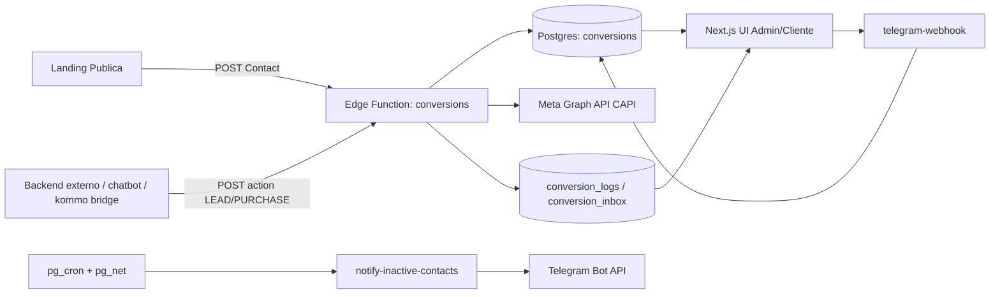
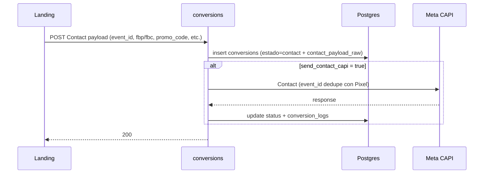
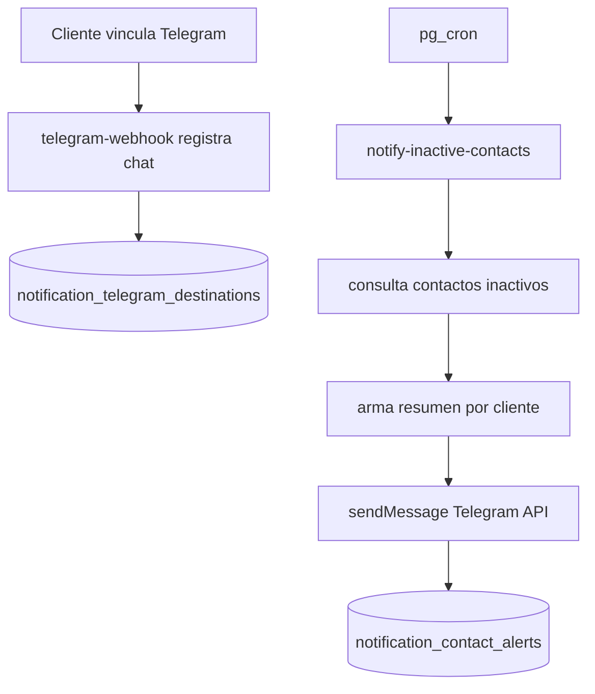

# Landing Builder v2

Plataforma multi-tenant para:
- Crear/gestionar landings.
- Capturar conversiones (`Contact`, `Lead`, `Purchase`) con trazabilidad completa.
- Enviar eventos a Meta CAPI con deduplicacion Pixel+CAPI.
- Operar seguimiento comercial y notificaciones de inactividad por Telegram.

Stack principal:
- Frontend: Next.js (`frontend/`)
- Backend/serverless: Supabase Edge Functions (`supabase/functions/`)
- DB: Postgres/Supabase + migraciones (`supabase/migrations/`)
- Infra operativa: `pg_cron` + `pg_net` + Vercel

---

## 1. Objetivo del proyecto

El sistema centraliza el funnel de conversiones de multiples clientes (admin + clientes finales):
- Cada cliente tiene su configuracion de conversiones y columnas visibles.
- El flujo soporta landings internas del constructor y landings externas conectadas.
- Se mantiene historial de eventos, logs tecnicos y payloads raw para auditoria/debug.

No se limita a reporting: tambien ejecuta logica operativa (dedupe, retries, notificaciones, sincronizacion de telefonos, webhook Telegram).

---

## 2. Mapa funcional (A -> Z)

### 2.1 Captura
- **Contact**: llega desde la landing publica al endpoint `conversions`.
- **Lead/Purchase**: llegan por JSON desde backend externo/chatbot/kommo-intermediarios.

### 2.2 Persistencia
- Se guarda cada conversion en `public.conversions`.
- Se guardan payloads raw por tipo:
  - `contact_payload_raw`
  - `lead_payload_raw`
  - `purchase_payload_raw`

### 2.3 Envio Meta CAPI
- El backend construye payload CAPI.
- Normaliza parametros (`fbp/fbc`, email, phone, nombre, geo, etc.).
- Hashea campos que corresponden.
- Envia a Graph API y registra respuesta/log.

### 2.4 UI operativa
- **CONVERSIONES**: Funnel, Tabla, Estadisticas, Configuracion, Logs.
- **SEGUIMIENTO**: ranking operativo por jugador (ultima actividad, cargas, promedio, total).
- **NOTIFICACIONES**: Telegram + reglas de inactividad.

### 2.5 Automatizaciones
- Cron de reintento de conversiones fallidas.
- Cron de notificaciones por inactividad.
- Cron de sincronizacion/precarga de telefonos para landings.

---

## 3. Arquitectura de alto nivel


```mermaid
flowchart LR
  A[Landing Publica] -->|POST Contact| B[Edge Function: conversions]
  X[Backend externo / chatbot / kommo bridge] -->|POST action LEAD/PURCHASE| B
  B --> C[(Postgres: conversions)]
  B --> D[Meta Graph API CAPI]
  B --> E[(conversion_logs / conversion_inbox)]
  C --> F[Next.js UI Admin/Cliente]
  E --> F
  G[pg_cron + pg_net] --> H[notify-inactive-contacts]
  H --> I[Telegram Bot API]
  J[telegram-webhook] --> C
  F --> J
```

---

## 4. Estructura del repo

- `frontend/`
  - App Next.js (admin/cliente), dashboards, tablas, tabs y componentes.
- `supabase/functions/`
  - Edge Functions de negocio y operacion.
- `supabase/migrations/`
  - Evolucion del esquema SQL.
- `scripts/`
  - Utilidades de encoding/hooks.
- `docs/`
  - Documentacion adicional.

Funciones clave en `supabase/functions/`:
- `conversions`
- `retry-failed-conversions`
- `notify-inactive-contacts`
- `telegram-webhook`
- `configure-telegram-webhook`
- `create-client`, `update-client`, `delete-client`, `list-clients`
- `landing-phone`, `sync-phones`, `phone-click`, `reset-phone-counters`

Alta de clientes:
- Los signups publicos de Supabase Auth estan bloqueados por trigger en `auth.users`.
- La unica ruta valida para crear clientes es `create-client`, invocada por un usuario `admin`.
- `create-client` marca el usuario con `app_metadata.panelbot_admin_created = true`; esa marca permite el insert en Auth y crea el `profile`.
- `list-clients` solo lista usuarios con `profile` completo y `nombre` asignado, evitando mostrar cuentas externas o incompletas.

---

## 5. Modelo de datos (resumen)

Tablas principales:
- `conversions`: eventos/filas de conversion por cliente.
- `conversions_config`: config por cliente (Meta, columnas visibles, logs, umbrales).
- `conversions_pixel_configs`: configuraciones Meta CAPI por pixel (multi-pixel por cliente).
- `conversion_logs`: log tecnico y respuesta Meta.
- `conversion_inbox`: dedupe de `action_event_id` y trazabilidad de eventos entrantes.
- `notification_settings`: reglas de notificacion.
- `notification_telegram_destinations`: destinos Telegram vinculados por cliente.
- `notification_contact_alerts`: control de re-notificacion por contacto.
- `profiles`, `landings`, `gerencias`, `gerencia_phones` y relacionadas.

Campos de trazabilidad en `conversions`:
- `contact_payload_raw`
- `lead_payload_raw`
- `purchase_payload_raw`

Estos campos guardan el JSON original recibido, sin perder contexto de origen.

---

## 6. Flujos de conversion (detallado)

### 6.1 Contact


```mermaid
sequenceDiagram
  participant L as Landing
  participant C as conversions
  participant DB as Postgres
  participant M as Meta CAPI

  L->>C: POST Contact payload (event_id, fbp/fbc, promo_code, etc.)
  C->>DB: insert conversions (estado=contact + contact_payload_raw)
  alt send_contact_capi = true
    C->>M: Contact (event_id dedupe con Pixel)
    M-->>C: response
    C->>DB: update status + conversion_logs
  end
  C-->>L: 200
```

### 6.2 Lead (`action: LEAD`)
- Match principal: `promo_code`.
- Fallback (segun version/config): `phone` si aplica.
- Guarda `lead_payload_raw`.
- Actualiza/crea fila y envia `Lead` CAPI.

### 6.3 Purchase (`action: PURCHASE`)
- Match principal: `promo_code`.
- Fallback: `phone`.
- Primera compra: `purchase_type=first`.
- Recompra: nueva fila heredando identidad relevante (`purchase_type=repeat`).
- Guarda `purchase_payload_raw`.
- Siempre conserva la clasificación interna first/repeat.
- Modo estándar: envía todas las compras una sola vez sin `purchase_type`.
- Modo clasificado: envía los tipos habilitados y agrega `purchase_type` al mismo evento estándar `Purchase`.
- Antes de procesar, reserva atómicamente un único `event_id` por `coelsa_id`, `transaction_id`, `action_event_id`, `purchase_event_id` o `event_id`; los webhooks concurrentes quedan deduplicados.
- Si el emisor no aporta ninguno de esos identificadores, la compra se procesa para no descartar una operación legítima, pero queda marcada en `observaciones` y Logs como `DEDUPE NO GARANTIZADO`.
- Envía `Purchase` CAPI con `custom_data` (`value`, `currency`, `purchase_type` cuando corresponde).

### 6.4 Dedupe de eventos entrantes por `action_event_id`
- Si llega `action_event_id` y ya fue procesado:
  - se ignora el duplicado,
  - se responde sin reprocesar,
- queda trazabilidad en inbox/log.

### 6.5 Atrio como destino de CTA
- El modulo **ATRIO** permite cargar clientes de Atrio por workspace con:
  - `slug` publico (`https://www.atrio.website/<slug>`),
  - `atrio_id` unico del cliente en Atrio.
- En el editor de landing se elige `Destino del CTA = Atrio` y se selecciona un cliente Atrio del workspace actual.
- WhatsApp no cambia: si el destino es WhatsApp, la landing sigue pidiendo telefono ganador y armando `wa.me`.
- Atrio conserva el flujo de tracking de landing:
  - la landing genera `Contact`,
  - genera `promo_code`,
  - redirige al webchat con `promo_code` y `atrio_id`,
  - guarda en `conversions` los campos `atrio_id`, `atrio_client_id` y `atrio_slug`.
- Los eventos `LEAD` y `PURCHASE` de Atrio deben enviar:
  - `source_platform: "atrio"`,
  - `atrio_id`,
  - `promo_code` cuando exista,
  - `phone` si Atrio lo conoce.
- Matching Atrio:
  - principal: `promo_code` con validacion de `atrio_id` compatible,
  - fallback conservador: `phone + atrio_id` dentro de 24 horas cuando no hay `promo_code`,
  - si no hay `promo_code` ni match por `phone + atrio_id`, no se atribuye automaticamente.

---

## 7. Multi-pixel (implementacion actual)

### 7.1 Objetivo
Permitir que **un mismo cliente** tenga **uno o mas pixeles Meta** y que cada evento CAPI salga por el pixel correcto segun la conversion.

### 7.2 Tabla de configuracion
- `public.conversions_pixel_configs`
  - `user_id`
  - `pixel_id`
  - `meta_access_token`
  - `meta_currency`
  - `meta_api_version`
  - `is_default`

Reglas:
- Unicidad por cliente+pixel (`user_id`, `pixel_id`).
- Un unico pixel `default` por cliente.
- Backfill automatico desde `conversions_config` (legacy) al crear la estructura multi-pixel.

### 7.3 Resolucion de pixel/token al enviar CAPI
Para cada envio (`Contact`, `Lead`, `Purchase`) el backend resuelve asi:
1. Pixel de la fila de conversion (`conversions.pixel_id`) si existe y esta configurado en `conversions_pixel_configs`.
2. Si no encuentra match, usa el pixel marcado como `is_default=true`.
3. Fallback final a `conversions_config` (compatibilidad retroactiva).

Esto se aplica tanto en:
- `supabase/functions/conversions`
- `supabase/functions/retry-failed-conversions`

### 7.4 Trazabilidad
- `conversions.pixel_id` (columna de tabla/UI) permite auditar por que pixel se proceso el evento.
- `conversion_logs` guarda payload/respuesta Meta para diagnostico por evento.

### 7.5 Compatibilidad
- No rompe clientes viejos: si solo existe config legacy, sigue funcionando.
- Si la landing manda `pixel_id` en Contact, ese valor queda atado a la conversion para envios posteriores.

---

## 8. Envio a Meta CAPI (compatibilidad y buenas practicas)

La logica actual:
1. Recibe payload.
2. Normaliza parametros CAPI.
3. Hashea campos requeridos.
4. Envia a Meta.

Normalizacion aplicada antes de hash/envio:
- `email`, `phone`, `fn`, `ln`, `external_id`
- `ct`, `st`, `zip`, `country`
- `fbp`, `fbc` (formato Meta)

Notas:
- `fbp`/`fbc` no se hashean.
- Si un valor no cumple formato esperado, se limpia o se omite para evitar ruido.
- Se mantiene dedupe Pixel + CAPI con `event_id` en Contact.

### 8.1 Workspaces ARS/PYG y moneda

El proyecto usa una sola tabla `public.conversions`, pero cada fila queda separada por
workspace mediante `currency`:

- `ARS`: workspace Argentina.
- `PYG`: workspace Paraguay.

La columna `workspace_resolution_source` guarda la senal que resolvio el
workspace. La UI la muestra como nota legible para auditoria.

Orden general de resolucion:
1. Workspace informado por payload/landing cuando existe.
2. Workspace heredado del recorrido previo de la conversion.
3. Workspace inferido por promo/tag/landing asociada.
4. Workspace de la gerencia que recibio el evento.
5. Workspace inferido por prefijo del telefono (`549/54` => ARS, `595` => PYG).
6. Fallback historico.

Para `LEAD` y `PURCHASE` se preserva el workspace primario del recorrido. Si el
evento posterior llega por una gerencia del mismo workspace, se agrega
trazabilidad de verificacion. Si llega por una gerencia de otro workspace, la
fila se procesa internamente, pero el envio CAPI de ese evento se omite con
estado `skipped_workspace_conflict` para evitar enviar moneda o dataset
incorrectos a Meta.

### 8.2 Landing vs WhatsApp Cloud API

- Landing page -> WhatsApp:
  - `action_source = website`.
  - Usa Pixel CAPI.
  - Conserva `fbp/fbc` del navegador.
  - Si `fbc` esta vencido, debe omitirse o reemplazarse solo por uno mas nuevo
    y confiable del mismo recorrido.

- Click-to-WhatsApp directo via WhatsApp Cloud API:
  - `action_source = business_messaging`.
  - Usa Dataset Business Messaging, no Pixel.
  - Evento Meta para Lead: `LeadSubmitted`.
  - Eventos enviados al endpoint del dataset:
    `/{DATASET_ID}/events`.
  - User data clave: `whatsapp_business_account_id` y `ctwa_clid`.
  - `ctwa_clid` se guarda desde el `referral` del primer mensaje entrante y no
    se hashea.

---

## 9. Dashboard de Conversiones

Tabs principales:
- `Funnel`
- `Tabla`
- `Estadisticas`
- `Configuracion`
- `Logs` (si habilitado)

### 9.1 Tabla
- Muestra filas de `conversions`.
- Soporta columnas configurables por cliente/admin.
- Incluye payloads raw (`contact/lead/purchase`) para trazabilidad.
- Incluye columnas de workspace y resolucion para auditar separacion ARS/PYG.
- La exportacion PDF usa la tabla reducida y respeta filtros/eventos elegidos.

### 9.2 Logs
- Muestra entradas de `conversion_logs`.
- Incluye payload enviado a Meta y respuesta recibida (cuando aplica).

### 9.3 Estadisticas
- Filtro de fecha.
- Filtro por landing (visualizacion, no altera datos).
- Excluye filas de prueba (`test_event_code`) donde corresponda.
- Graficos de distribucion por hora, dia y dia de semana.
- Curva de ingresos y curva de variacion horaria del embudo con suavizado
  visual.
- La SMA aparece apagada por defecto en graficos.

### 9.4 Desempeno
- Respeta los filtros globales de Conversiones.
- La disponibilidad se calcula por demanda, a partir de solicitudes reales de
  telefono, y no por cron operativo recurrente.
- El PDF de desempeno usa el mismo estilo visual que el PDF de tabla.

---

## 10. Seguimiento

Vista operativa para contacto de jugadores:
- Ranking configurable por reglas (indicador por total cargado).
- Ultima vez activo.
- Cargas, carga promedio, total cargado.
- Integracion directa a WhatsApp para seguimiento.
- Paginacion y busqueda para rendimiento/operatividad.
- El ranking agrupa por `phone + gerencia_id` para evitar cruces entre
  recorridos de distintas gerencias.
- Eliminar jugador actua sobre la fila/relacion `phone + gerencia_id`.

---

## 11. Notificaciones Telegram

Componentes:
- Configuracion de canal y reglas de envio.
- Vinculacion de chat(es) por webhook de Telegram.
- Envio de resumen agrupado de contactos inactivos.

Reglas:
- Umbral de inactividad (`inactive_days`).
- Re-notificacion (`renotify_days`).
- Hora de envio (zona Buenos Aires).

Flujo:


```mermaid
flowchart TD
  A[Cliente vincula Telegram] --> B[telegram-webhook registra chat]
  B --> C[(notification_telegram_destinations)]
  D[pg_cron] --> E[notify-inactive-contacts]
  E --> F[consulta contactos inactivos]
  F --> G[arma resumen por cliente]
  G --> H[sendMessage Telegram API]
  H --> I[(notification_contact_alerts)]
```

---

## 12. Landings internas y externas

Tipos:
- `interna`: renderizada/gestionada completamente por el constructor.
- `externa (conectada)`: frontend propio de tercero, pero usa utilidades del constructor.

Para landing externa:
- Usa endpoint de conversiones del constructor.
- Debe enviar payload compatible (event_id, external_id, promo_code, fbp/fbc, etc.).
- Debe integrar obtencion de telefono (`landing-phone`) si usa rotacion/asignacion.
- Debe enviar el workspace de la landing cuando aplica, para separar ARS/PYG
  desde el Contact.

### 12.1 WhatsApp Cloud API

La seccion `WhatsApp Cloud API` permite usar un numero oficial de Meta como
entrada directa Click-to-WhatsApp. Internamente se comporta como una landing:
recibe un mensaje, asigna una gerencia/telefono, responde con un enlace/boton
al asesor y conserva el recorrido para `LeadSubmitted` y `Purchase`.

Componentes:
- Configuracion de identidad Meta:
  - nombre interno,
  - telefono visible,
  - Phone Number ID,
  - WhatsApp Business Account ID,
  - verify token,
  - access token permanente de System User,
  - app secret,
  - version Graph API.
- Tracking:
  - Dataset Business Messaging ID,
  - URL Post/Tracking,
  - tag del flujo.
- Redireccion:
  - mismas reglas visuales y operativas que el editor de landings.
  - asignacion por gerencia, modo, tipo y criterio.
- Respuesta automatica:
  - variables disponibles: `{{name}}`, `{{phone}}`, `{{promo_code}}`,
    `{{wa_link}}`.
  - puede usar link directo o boton CTA.
- Inbox:
  - muestra mensajes entrantes/salientes,
  - estado no leido,
  - tags de estado (`Nuevo`, `Contact`, `Lead`, `Cargo`, `Recargo`,
    `Premium`),
  - gerencia asignada,
  - datos de derivacion y metricas del contacto.
- Logs:
  - webhooks,
  - worker,
  - respuestas salientes,
  - errores de integracion.

Semantica de eventos:
- Mensaje entrante inicial: crea conversacion/inbox con estado `Nuevo`, pero no
  crea `Contact` en `conversions`.
- Click en el link/boton al asesor: crea el `Contact` interno, igual que el CTA
  de una landing.
- `LeadSubmitted` y `Purchase`: matchean primero por `promo_code`; si no hay
  promo, WhatsApp Cloud API puede matchear por `phone + gerencia/telefono
  asignado` dentro de la ventana configurada.

Seguridad operativa:
- El webhook debe estar desplegado sin `verify_jwt`, porque Meta no envia JWT de
  Supabase.
- El webhook valida la firma `X-Hub-Signature-256`.
- El webhook guarda el evento antes de procesarlo.
- El worker separado evita bloquear la respuesta a Meta.
- Existe reintento para eventos pendientes/trabados.
- Los mensajes manuales solo se permiten dentro de la ventana de 24 horas.
- Fuera de la ventana de 24 horas se requieren templates aprobados por Meta.

### 12.2 Telefonos de gerencia

Los telefonos sincronizados desde PanelBotAdmin pueden marcarse como:
- WhatsApp publicitario: entra al pool de seleccion para publicidad/landing.
- WhatsApp de venta: queda fuera del pool de seleccion, pero conserva metricas y
  trazabilidad si pertenece a la misma gerencia.

La sincronizacion respeta la marca previa; no vuelve automaticamente un WhatsApp
de venta al pool publicitario.

---

## 13. Operacion, cron y retries

Automatizaciones principales:
- `retry-failed-conversions`: reintenta envios CAPI fallidos.
- `sync-phones`: sincroniza/actualiza disponibilidad de telefonos.
- `notify-inactive-contacts`: envio de resumentes Telegram.
- `warm-landing-phone`: precalentamiento de telefonos por cron.
- `refresh_constructor_landing_phone_cache`: cachea disponibilidad rapida para
  landings del constructor.
- `refresh_phone_metrics`: recalcula metricas UI de telefonos con menor
  frecuencia para reducir carga.

Notas recientes:
- La disponibilidad de desempeno paso de un cron recurrente pesado a medicion
  por demanda.
- `gerencia_phone_availability_snapshots` ya no se usa como fuente operativa
  para desempeno.
- Las metricas de telefonos son UI/cache; la seleccion real de telefono para CTA
  usa la logica directa de asignacion.

Recomendacion:
- Revisar periodicamente `cron.job` y `cron.job_run_details`.
- Verificar `net._http_response` para diagnostico de llamadas cron->functions.

---

## 14. Setup local

### 13.1 Frontend
```bash
cd frontend
npm install
npm run dev
```

`frontend/.env.local` minimo:
- `NEXT_PUBLIC_SUPABASE_URL`
- `NEXT_PUBLIC_SUPABASE_ANON_KEY`
- `NEXT_PUBLIC_META_IP_COLLECTOR_URL` (opcional): URL publica del colector dual-stack.
- `META_IP_PROOF_SECRET` (opcional): secreto HMAC compartido con el colector.

El colector de IP para Meta se encuentra en `infra/meta-ip-collector`. La landing lo consulta en segundo plano, sin bloquear el CTA, y conserva la IP observada por Vercel como fallback.

### 13.2 Supabase CLI
```bash
supabase --version
supabase db push
supabase functions deploy conversions
supabase functions deploy retry-failed-conversions
```

---

## 15. Deploy

- Frontend: Vercel (`main`).
- Backend: Supabase Edge Functions.
- DB: migraciones SQL via `supabase db push`.

Checklist de release:
1. `git status` limpio.
2. Migraciones aplicadas.
3. Funciones desplegadas tocadas en el cambio.
4. Smoke tests de `Contact`, `LEAD`, `PURCHASE`.
5. Verificacion en `conversion_logs` y Meta Events Manager.

---

## 16. Calidad y seguridad de texto (anti-mojibake)

Incluye:
- `.editorconfig` (`charset=utf-8`)
- `.gitattributes` (`text=auto eol=lf`)
- `scripts/check-encoding.js`
- hooks locales (`.githooks`)
- CI workflow de encoding

Instalacion hooks:
```bash
powershell -ExecutionPolicy Bypass -File scripts/install-git-hooks.ps1
```
o
```bash
sh scripts/install-git-hooks.sh
```

---

## 17. Troubleshooting rapido

- **No llega evento a Meta**:
  - revisar `conversion_logs` (`payload_meta`, `response_meta`)
  - validar configuracion en `conversions_pixel_configs` (y fallback legacy `conversions_config`)
  - validar que `conversions.pixel_id` tenga match con un pixel configurado
  - revisar status HTTP en logs

- **No llegan notificaciones Telegram**:
  - validar `notification_settings.enabled`
  - validar destinos activos en `notification_telegram_destinations`
  - revisar corridas cron y `net._http_response`

- **Descuadre de metricas**:
  - revisar dedupe (`event_id` Contact y `action_event_id` en inbox)
  - revisar payloads raw en tabla (`contact/lead/purchase_payload_raw`)

---

## 18. Documentacion complementaria

- [frontend/README.md](frontend/README.md)
- [CRON-SETUP.md](CRON-SETUP.md)
- [supabase/migrations/README.md](supabase/migrations/README.md)
- [docs/META_CAPI_PAYLOAD.md](docs/META_CAPI_PAYLOAD.md)
- [docs/whatsapp-cloud-api.md](docs/whatsapp-cloud-api.md)

---

## 19. Estado actual

El proyecto esta preparado para:
- Operacion multi-cliente.
- Operacion multi-pixel por cliente, con seleccion de pixel por evento.
- Trazabilidad completa de conversiones.
- Robustez de ingestion + retries + logs.
- Envio Meta CAPI con normalizacion consistente.
- Seguimiento comercial + notificaciones Telegram productivas.
# Checkpoints operativos

- `checkpoint-before-atrio-20260818`: estado estable del constructor antes de iniciar la integracion de Atrio.

# Integracion Atrio

Atrio se integra como un destino alternativo del CTA de una landing. La landing conserva el flujo actual de tracking: genera `external_id`, `event_id`, `promo_code`, captura parametros Meta y envia `Contact` al endpoint de conversiones. La diferencia es solo la redireccion final:

- `WhatsApp`: obtiene un telefono ganador desde `landing-phone`, registra `phone-click` y abre `wa.me`.
- `Atrio`: no consulta `landing-phone`; redirige a la URL configurada de Atrio agregando solo `promo_code` como query param.

Para trazabilidad, el payload de `Contact` incluye `cta_destination` y `redirect_channel`. `LEAD` y `PURCHASE` de Atrio deben matchear por `promo_code` completo contra el `Contact` previo. Si Atrio no trae `phone`, no se aplican fallbacks por telefono.
