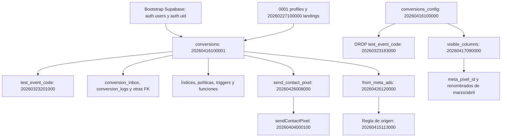

# Fase 0B — diagnóstico y propuesta para aprobación

<!-- phase0b-pg-net-current:start -->
## Estado vigente después de resolver pg_net

Fase 0B cerrada. Dos reconstrucciones de 268/268, fingerprints iguales, 446 comprobaciones distintas aprobadas y cero diferencias pendientes. pg_net 0.19.5 se instala nativamente en la base local vacía; sus funciones y permisos coinciden con remoto. Detalle: phase0b-bootstrap-report.md y phase0b-pg-net-resolution.md. No se inició Fase 0C ni Fase 1.

Los resultados inferiores son antecedentes históricos; no reemplazan este dictamen.
<!-- phase0b-pg-net-current:end -->


## Estado histórico: compatibilidad post-hist?rica

La capa post-hist?rica de RLS fue autorizada e implementada. Dos reconstrucciones de 268/268 con fingerprints id?nticos, 324 pruebas existentes y 67 escenarios nuevos aprobados (391 distintos). El bloqueo restante es exclusivamente la seguridad de net.http_get/http_post: ejecuci?n, search_path y ACL locales difieren de remoto. No se normaliz? ni modific? esa seguridad. Ver phase0b-bootstrap-report.md y phase0b-net-security-pending.md.

## Historial de continuaciones anteriores


## Estado histórico de esta continuaci?n

Fase 0B: dos reconstrucciones completas de 268/268, fingerprints id?nticos; 324 pruebas aprobadas, 0 fallidas. .env retirado del ?ndice e ignorado sin modificar sus bytes; secuencia vac?a corregida con autorizaci?n. El cierre sigue bloqueado por 20 diferencias estructurales revisadas, incluidas 11 de seguridad (RLS, funci?n/event trigger y grants) fuera de la excepci?n mec?nica. No se modific? producci?n. Ver phase0b-bootstrap-report.md, phase0b-schema-review.md y bootstrap-final-summary.json. Las secciones hist?ricas inferiores no sustituyen este estado.

## Historial de informes anteriores


## Resultado vigente de la implementación autorizada

La excepción adicional para sanitizar `20260427190000` fue autorizada y aplicada. El manifiesto y el runner local/CI ya existen; comando canónico: `node scripts/phase0/run-bootstrap-validation.mjs`. Ver `phase0b-bootstrap-report.md` y `supabase/bootstrap/README.md` para el diseño efectivo y las barreras de seguridad.

Fase 0B sigue bloqueada: dos intentos aprobaron 35 migraciones y fallaron en `20260325201000` por setval(0) en una base vacía, con SQLSTATE 22003. No se cambió esa migración. Las 299 comprobaciones existentes y 19 pruebas adicionales pasan, pero no hay reconstrucciones completas ni paridad estructural final acreditada. Se conservaron los dos SQL autorizados en sus rutas originales; no se creó la carpeta recovered propuesta inicialmente. Las secciones inferiores se conservan como historial del plan y de sus decisiones previas.

## Actualización tras autorizar la implementación

El bootstrap y la recuperación fueron autorizados posteriormente. Al recuperar las dos versiones, se acreditaron sus hashes pero se detectó una credencial literal en `20260427190000`. No se persistió ni expuso ese valor y no se modificó ningún placeholder. La ejecución está bloqueada pendiente de decidir una adaptación local no literal. Ver `phase0b-recovery-decision.md` para el SQL propuesto y `phase0b-recovery-provenance.json` para la procedencia y comparación semántica. El plan original de abajo se conserva; todavía no hay un runner nuevo implementado ni reconstrucciones completas.

Fecha: 2026-09-16. Base: rama `main`, commit `a4e752cf58f628813d3979d598b60d480caaac8d`. Esta entrega contiene diagnóstico, inventarios y diseño. No implementa la reparación, Fase 0C ni Fase 1. Las 268 migraciones históricas conservan nombres, contenido y ubicación. No hubo escrituras remotas, deploy, commit ni push.

## 1. Causa raíz comprobada

El replay ya registrado en `local-start-replay.json` ejecutó 28 migraciones, falló en la 29 y dejó 239 sin ejecutar. En `20260323201000_conversions_add_test_event_code.sql`, el `ALTER TABLE IF EXISTS` de línea 1 omite la tabla inexistente; el `COMMENT ON COLUMN public.conversions.test_event_code` de línea 4 falla sin esa protección. Agregar otro IF EXISTS ocultaría el problema y perdería la columna: no es una reparación aceptable.

La tabla aparece recién en `20260416100001_conversions.sql`, posición 73. Git demuestra que ese archivo se incorporó el **16 de marzo** en `460269b523ff044613c196178eaf55d89cdb052f`, junto con los archivos `20260416100000_conversions_config.sql`, `20260416100002_sync_pixel_trigger.sql` y `20260416100003_cron_retry_conversions.sql`. Sus nombres señalan el **16 de abril**. El consumidor del 23 de marzo se incorporó después, en `5c850260e54ab59d6b5ed5042312f0a2ecea073e`, pero ordena antes por nombre. La cadena por timestamp no representa el orden de introducción ni sus dependencias.

La creadora está presente en Git y en el historial remoto. No hace falta suponer una creación manual para explicar este fallo. No se encontraron migraciones eliminadas en el historial Git disponible y el repositorio no es shallow. Eso no demuestra que jamás se haya usado dashboard, SQL manual, `db pull` o `migration repair`: el ledger registra versiones, no una cronología verificable de ejecución ni el canal de aplicación. No se consultaron actores o datos de usuarios. La causa verificable es el timestamp fuera de orden; el procedimiento histórico de aplicación remota sigue sin acreditarse.

El bloqueo de Vector en Docker es independiente: `vector-diagnostic.json` registra la API Docker de `host.docker.internal:2375` inaccesible. La alternativa sin observabilidad permitió llegar al replay. Cambiar Docker no resuelve las dependencias SQL. No se repitieron arranques en esta fase de diseño.

## 2. Grafo, objetos y fallos posteriores

El grafo detallado está en `phase0b-dependency-graph.md`; `phase0b-dependencies.json` agrega líneas, tipos de statement, versiones y SHA256 de los 268 archivos. Es análisis léxico revisado, no un ordenador semántico de SQL ni un manifiesto ejecutable. Distingue referencias directas, condicionales y cuerpos de funciones. Se incluyeron las referencias sin prefijo de esquema y se verificó su `search_path = public`.



La creadora requiere `auth.users(id)`, `public.landings(id)`, `public.profiles(id, role)`, `auth.uid()` y disponibilidad de `gen_random_uuid()`. Profiles y landings tienen migraciones anteriores; auth y sus funciones pertenecen al bootstrap de Supabase. No necesita que conversion_logs ya exista.

Todos los archivos anteriores a la creadora que referencian conversions en SQL son:

| Posición | Archivo | Naturaleza |
| ---: | --- | --- |
| 29 | 20260323201000_conversions_add_test_event_code.sql | ALTER condicional y COMMENT directo: primer fallo |
| 33 | 20260325201000_add_internal_id_to_conversions.sql | Columna, backfill, secuencia e índice |
| 39 | 20260326235900_conversion_inbox.sql | Foreign key directa |
| 51 | 20260330193500_conversions_add_meta_pixel_id.sql | Columna, backfill y visible_columns |
| 55 | 20260401102000_conversions_delete_policy.sql | Políticas RLS |
| 57 | 20260404000100_rename_send_contact_pixel_to_sendContactPixel.sql | Rename condicional y UPDATE de configuración |
| 64 | 20260407190000_get_phone_for_chatrace_client.sql | Referencia sin esquema dentro de PL/pgSQL |
| 66 | 20260407205000_get_phone_for_chatrace_client_with_selection_mode.sql | Referencia sin esquema dentro de PL/pgSQL |
| 68 | 20260408213000_fair_gerencia_counter_include_inactive.sql | Referencias sin esquema dentro de PL/pgSQL |
| 69 | 20260408220000_fair_gerencia_messages_include_inactive.sql | Referencias sin esquema dentro de PL/pgSQL |
| 70 | 20260415113000_from_meta_ads_fbc_or_valid_promo_code.sql | Función, COMMENT y UPDATE de una columna futura |

Los cuerpos PL/pgSQL no implican necesariamente un error al crear la función; pueden fallar al invocarla. No se cuentan como once fallos efectivamente ejecutados: solo el primero fue observado en el replay original.

Otros problemas comprobados por inspección:

- `conversions_config`: el DROP de `test_event_code` en posición 28 no hace nada sobre una base vacía; la creadora posterior reintroduciría la columna obsoleta. También hay ALTER/INSERT/UPDATE anteriores: `20260325193000`, `20260325193500`, `20260326121000`, `20260330160000`, `20260330193000`, `20260330193500`, `20260404000100` y `20260404000200`. `visible_columns` requiere específicamente `20260417090000`, no basta adelantar la tabla.
- `conversion_logs`: su creadora `20260416200000_conversion_logs.sql` es posterior al ALTER de `20260325190000`, a la FK de `20260406203000_hidden_conversion_logs.sql`, al cambio de `20260406235900` y al backfill de `20260407001000`. El primer ALTER podría omitirse silenciosamente; los demás contienen dependencias directas.
- `send_contact_pixel` se agrega en `20260426008000`; el rename de `20260404000100` debe ejecutarse después. Si se omite, el esquema final conservaría el nombre incorrecto.
- `from_meta_ads` se agrega en `20260426120000`, pero `20260415113000` comenta y actualiza esa columna. Además existen seis definiciones sucesivas de su función: adelantar una creadora sin controlar las redefiniciones puede restaurar una regla antigua. La huella del cuerpo remoto actual coincide exactamente, normalizando CRLF, con `20260821220917_include_ctwa_in_meta_ads_origin.sql`. Esa definición final debe preservarse.
- `20260407203000_chatrace_gerencia_selection_mode.sql` modifica una tabla creada en `20260426009000_chatrace_client_configs.sql`.
- `20260424222000_sanitize_phone_prefix_localidad.sql` actualiza `ar_phone_area_codes`, creada en `20260426130000_create_ar_phone_area_codes.sql`.

No se afirma que esta lista descarte todo error posterior: SQL dinámico, datos de backfill y dependencias de plataforma necesitan un replay completo. El futuro runner debe detenerse al primer fallo y conservar la evidencia, sin saltear archivos.

### Dependencias del esquema remoto actual

Conversions tiene 121 columnas, 55 índices, 6 políticas y 3 triggers no internos. Los nombres, firmas y huellas completas están en `phase0b-dependencies.json` → `remoteConversions`; no se reproducen cuerpos SQL remotos.

- Políticas: Users/Admins can read/update/delete own/all conversions. Se registraron roles, comandos y hashes de USING/WITH CHECK.
- Triggers: `trg_set_conversions_from_meta_ads` → `public.set_conversions_from_meta_ads`; `trg_set_conversions_sex_fields` → `public.set_conversions_sex_fields`; `close_landing_phone_reservation_on_lead` → `private.close_landing_phone_reservation_on_lead`.
- FK salientes: landings, auth.users y autoatribuciones Lead/Pixel/Purchase. FK entrantes: conversion_inbox, conversion_logs, hidden_conversions, landing_phone_assignment_reservations, purchase_event_claims y whatsapp_cloud_api_assignments, además de las autoatribuciones.
- Hay 19 firmas de funciones públicas con referencias textuales directas: familias de Inicio, Audiencias, teléfonos, WhatsApp, métricas y moneda de logs. `private.landing_phone_message_load` agrega una referencia directa privada. Las funciones de trigger que usan NEW/OLD también son dependientes aunque no nombren explícitamente la tabla.
- `phase0b-platform-metadata.json` guarda 376 entradas de dependencias de catálogo, incluidas dependencias por columna. No son 376 objetos únicos. `pg_depend` no representa por sí solo todas las referencias dinámicas de PL/pgSQL.

## 3. Comparación local/remota y límites

Se utilizaron exclusivamente SELECT de catálogo y del ledger, dentro de `BEGIN READ ONLY`, `statement_timeout = 8s`, `lock_timeout = 1s`, terminando con ROLLBACK. No hubo lectura de filas de negocio, ejecución de RPC productivas, EXPLAIN ANALYZE ni exportación de function bodies, cron commands, defaults en claro o credenciales.

Resultado: **268 versiones locales y 268 remotas; ninguna versión exclusiva de un lado**. Última: `20260915190657`. Hay dos discrepancias acreditadas de nombre y contenido:

| Versión | Archivo local | Historial remoto | Evidencia remota permitida |
| --- | --- | --- | --- |
| 20260427180000 | remote_sync_placeholder | tracking_queue | 6 statements; crea tracking_queue y set_tracking_queue_updated_at |
| 20260427190000 | remote_sync_placeholder | tracking_retry_scheduler | 1 statement; programa cron y contiene llamada HTTP |

Ambos archivos locales son no-op (`SELECT 1`). Son contenido histórico faltante, aunque no falten versiones. Se incorporaron como placeholders en `5bac1164d74165d48c16d826b8a9e0ff71878083`. La migración `20260629190000_constructor_tracking_queue.sql` vuelve a declarar objetos relacionados; no demuestra equivalencia de la tabla original ni del scheduler anterior. No se recuperaron los cuerpos remotos en esta ejecución: podrían incorporar datos de conexión o secretos. La evidencia conservada es estructural.

Los SHA256 locales corresponden al texto de cada archivo; los MD5 remotos corresponden al array de statements serializado. No son checksums comparables entre sí. Para las otras 266 versiones se comprobó identidad de versión/nombre, no igualdad de todo su SQL.

Inventario público remoto: 71 relaciones, 267 índices, 152 políticas, 30 triggers, 84 funciones y 316 constraints. Se relevaron además las cinco funciones privadas de aplicación, event triggers y extensiones. La comparación está en `phase0b-structural-comparison.json`:

- Todos los nombres de tablas/vistas públicos actuales tienen declaraciones locales; esa coincidencia no garantiza igual definición.
- Las 121 columnas de conversions, 32 de conversions_config y 13 de conversion_logs tienen declaraciones locales. Sobran en el inventario histórico `send_contact_pixel` y el `test_event_code` global; se explican por el rename y DROP previstos. El inventario de nombres no es un esquema final ejecutado.
- Nueve secuencias no tienen CREATE SEQUENCE explícito en el análisis: son candidatas a generación implícita por SERIAL/IDENTITY, no drift demostrado.
- `public.rls_auto_enable()` y el event trigger `ensure_rls` existen remotamente y no tienen declaración local. La función no figura como miembro de una extensión. Su origen queda sin acreditar; no se atribuye automáticamente a Supabase ni se propone copiar RLS a ciegas.
- La función final `set_conversions_from_meta_ads` sí tiene coincidencia de cuerpo local/remoto; esa comprobación puntual no certifica todas las funciones.

**No existe todavía un diff final vacío.** La DB limpia no llega a construir el esquema. Faltan comparación ejecutada de definiciones, ACL/default privileges, vistas, configuración de funciones, secuencias, schemas de proveedor y efectos de cron. Las diferencias de plataforma deben identificarse por objeto, nunca excluirse con una regla global para hacer verde el informe.

## 4. Alternativas evaluadas

### A. Corregir la cadena histórica en supabase/migrations

Archivos candidatos: las creadoras `20260416100000`, `20260416100001`, `20260416200000`, `20260426009000`, `20260426130000`; los proveedores de columnas `20260417090000`, `20260426008000`, `20260426120000`; los consumidores detallados arriba y ambos placeholders. Renombrar creadores o mover statements exigiría calcular nuevos timestamps y revisar todas las redefiniciones; no alcanza editar un archivo.

Base vacía: podría permitir el CLI estándar después de reparar todas las dependencias. Entornos existentes: los archivos ya registrados no vuelven a ejecutarse solo por editar su contenido; renombrarlos cambia las versiones visibles. Futuros db push: riesgo de migraciones aparentemente nuevas, versiones remotas sin contraparte y necesidad de reconciliar el ledger. Drift alto entre una instalación nueva y una antigua. Rollback: restaurar el conjunto original antes de cualquier aplicación; tras tocar un ledger existente ya no basta revertir archivos. Riesgo alto. Descartada para este caso.

### B. Agregar una migración prerequisito

Archivo hipotético: nueva migración creada por la CLI, nunca un timestamp inventado. Una versión nueva al final llega demasiado tarde. Una versión retrodatada anterior al archivo 29 cambiaría el historial pendiente y requeriría tratamiento excepcional en instalaciones existentes.

Crear conversions antes sin modificar la creadora histórica produce un segundo fallo: `CREATE TABLE public.conversions` no tiene IF NOT EXISTS. También quedan columnas, config, logs y backfills fuera de orden. Futuros db push podrían intentar aplicar el prerequisito sobre tablas productivas ya existentes. Drift y rollback difíciles si agrega o borra objetos para compensar duplicados. Riesgo alto; no resuelve el problema por sí sola. Descartada.

### C. Baseline/squash para instalaciones nuevas

Archivos: SQL baseline nuevo, archivo de procedencia/checksums, archivo de DML/catálogos/cron revisado, conservación de la cadena antigua fuera del directorio activo y mecanismo de corte del ledger. Una base vacía podría obtener un esquema final equivalente sin reconstruir cada transformación histórica. Entornos existentes requieren una transición de historial explícita; no deben volver a aplicar CREATE sobre el esquema presente. Futuros db push necesitan separar baseline de incrementales y mapear el corte.

El squash de la CLI omite DML, incluidos cron, storage buckets y secretos de vault, según la [referencia oficial](https://supabase.com/docs/reference/cli/supabase-migration-squash). No se ejecutó. No permite cumplir literalmente «ejecutar las 268 sin omisiones». Drift medio/alto por pérdida de efectos; rollback previo a adopción = volver a la cadena original y descartar la DB nueva, posterior = transición inversa cuidadosamente planificada. Riesgo alto bajo estos criterios. Descartada salvo cambio explícito del criterio de aceptación.

### D. Historial legacy intacto y bootstrap local/CI por dependencias — recomendada

Archivos nuevos fuera de `supabase/migrations`: manifiesto versionado de las 268 rutas/hash/dependencias, runner local y comparación de catálogo; detalles en la sección siguiente. No se crea una segunda copia mantenida de las 268 migraciones. Se conserva un único conjunto de fuentes y una sola cadena incremental después del corte.

Base vacía: ejecuta los 268 archivos originales, cada uno una sola vez, en orden explícito de dependencias; se agregan solo complementos recuperados y auditados de las dos versiones incompletas. No se declara éxito hasta probar toda la ejecución y el diff estructural. Entornos existentes: ninguna operación, ni sobre sus datos ni sobre su ledger. Futuros db push: las versiones originales siguen coincidiendo; se aplicarán únicamente incrementales posteriores. El runner debe registrar la versión local después de ejecutar realmente su archivo y registrar aparte la procedencia de cualquier complemento. No se permite marcar como aplicada una versión omitida. La [documentación de migraciones](https://supabase.com/docs/guides/deployment/database-migrations) explica el seguimiento por versiones.

Drift medio: el orden adicional necesita revisión de backfills y redefiniciones, hashes inmutables y una comparación obligatoria en CI. El CLI estándar `db reset` seguirá sin poder reconstruir la historia por filename; se deberá usar el wrapper aprobado. `db diff` que reconstruye un shadow desde esa cadena tampoco debe presentarse como validación suficiente: se compararán catálogos de DB realmente construidas.

Rollback: detener el runner, conservar evidencia y descartar exclusivamente su DB/volumen temporal identificado; los fuentes históricos y producción no cambian. Riesgo medio, acotado a DB descartable; riesgo directo sobre producción nulo mientras se mantenga la prohibición de conexión/escritura remota. Requiere aceptar expresamente el wrapper como procedimiento de reconstrucción.

### E. Recuperar migraciones faltantes

Existe evidencia para recuperar el contenido de las versiones `20260427180000` y `20260427190000`; no para inventar otra creadora de conversions. Archivos posibles: reemplazar ambos placeholders, o guardar los cuerpos auditados en `supabase/bootstrap/recovered/` con vínculo a su versión y huella remota. Se recomienda esta segunda forma como parte de D, conservando intacto el directorio histórico.

Base vacía: recupera los efectos de tracking omitidos por los placeholders, pero no arregla el orden de conversions. Entornos existentes: no deben reejecutarlos, pues el ledger ya registra ambas versiones. Futuros db push: no deben aparecer como versiones nuevas. Drift medio hasta demostrar equivalencia con el DDL posterior. Rollback = retirar los complementos y reconstruir solo la base descartable, sin borrar tablas remotas. Riesgo medio por scheduler/HTTP y posible material sensible en SQL histórico. No es una solución independiente.

## 5. Secuencia exacta propuesta para la ejecución posterior

Nada de esta sección se implementó. El resultado de cada paso es un requisito del siguiente; no se promete que un orden léxico aproximado ya resuelva toda la historia.

1. Congelar el inventario actual: comprobar rama/HEAD, 268 nombres y hashes, los 19 artefactos originales y cero cambios productivos. Conservar el directorio histórico en su ubicación. Fijar el corte `20260915190657`; fallar ante un hash cambiado o una versión duplicada/desconocida.
2. Recuperar las dos versiones incompletas mediante una lectura controlada del ledger, con revisión de secretos antes de persistir nada. No volcar SQL crudo a consola/log. Conservar solo SQL sin secretos en archivos complementarios fuera de migrations; registrar hash de origen y diferencias. Si contiene credenciales/literales productivos, detener esa recuperación y presentar una adaptación local explícita para aprobación: no ocultar la diferencia ni copiar el secreto. No necesita cambiar el ledger remoto.
3. Crear un manifiesto de dependencias de los 268 archivos, con orden estable y motivo por arista. Incluir tablas, columnas, FK, índices, RLS, triggers, funciones, DML y redefiniciones. Adelantar creadores completos, no recortar/saltear statements. Añadir las dependencias de visible_columns, rename y from_meta_ads. Conservar el orden de sucesivas versiones de funciones después de resolver los prerrequisitos; asegurar la definición final de agosto. Ubicar cada complemento de tracking inmediatamente junto a su versión placeholder antes de sus consumidores. Detectar ciclos antes de ejecutar; si un ciclo exige editar SQL histórico, detenerse y volver con evidencia para otra aprobación.
4. Implementar un runner exclusivamente local: contexto Docker local; proyecto temporal nuevo sin linked, `.env`, seeds ni URLs remotas; comprobar identidad por socket/loopback y nombre/label propio; aislar la red de DB; deshabilitar ejecución de cron solo allí antes del SQL histórico; simular todo servicio externo. No invocar reset sobre el proyecto de trabajo. No admitir un `--db-url` arbitrario. Los schedules pueden crearse para comparar su estructura, pero no disparar HTTP externo. Usar la alternativa sin observabilidad documentada si Vector sigue bloqueado; nombrarla como alternativa, no como stack íntegro.
5. Ejecutar los 268 originales y los complementos auditados, con registro por archivo/statement, hash y resultado. Registrar cada versión local solo tras éxito; usar transacción por archivo donde el SQL lo permita. Un fallo invalida esa DB y el resultado global; no marcar applied, reintentar parcialmente ni continuar para obtener verde. Las funciones pg_temp deben mantenerse dentro de la sesión del archivo. No reusar una DB parcialmente construida para la siguiente prueba limpia.
6. Construir dos DB vacías independientes y exigir las mismas huellas finales y cobertura 268/268. Recoger catálogo con las consultas de esta entrega y ampliar la comparación a ACL, default privileges, schemas privados/proveedor, vistas, funciones, secuencias y cron con comandos sensibles hasheados. Cada diferencia frente a metadata remota debe tener objeto, motivo, impacto y aceptación. Resolver la procedencia/efecto de ensure_rls antes de aceptar paridad de RLS; no incorporar políticas nuevas como una «corrección» incidental.
7. Verificar en el ledger exclusivamente local las 268 versiones y las evidencias de ejecución. Probar un incremental sintético solo en el proyecto temporal: primer `migration up --local` lo aplica y el segundo no hace nada; verificar el plan local con `db push --local --dry-run`. Ningún cambio de historia remota. La equivalencia de SQL actual no puede inferirse de un dry-run sin pendientes.
8. Ejecutar las 299 comprobaciones existentes, TypeScript, build y ESLint; conservar resultados completos. Los runners actuales usan esquemas acotados y deben seguir identificados como tales. Agregar verificación SQL/API del esquema completamente reconstruido con fixtures sintéticos, sin reemplazar sus tablas por el esquema mínimo. No aceptar una prueba acotada como prueba de paridad de todos los triggers/RLS.
9. Actualizar evidencia y dictamen. Si falla un criterio, registrar archivo/objeto exacto y detenerse. No avanzar a 0C ni a Fase 1; no desplegar, commit o push.

### Archivos previstos, aún inexistentes

- `supabase/bootstrap/legacy-manifest.json`: 268 fuentes originales, SHA256, orden y aristas justificadas, corte y complementos.
- `supabase/bootstrap/recovered/20260427180000_tracking_queue.sql` y `20260427190000_tracking_retry_scheduler.sql`: solo tras recuperar/revisar contenido; no son nuevas versiones de migración.
- `supabase/bootstrap/README.md`: alcance exclusivo de instalaciones nuevas locales/CI, restricciones y rollback.
- `scripts/phase0/bootstrap-runtime.mjs`: aislamiento e identidad local, replay completo y ledger veraz.
- `scripts/phase0/run-bootstrap-validation.mjs`: dos reconstrucciones, incremental sintético local y validación del esquema completo.
- `scripts/phase0/compare-schema-metadata.mjs`: diff estructural con diferencias explicadas por objeto.
- `scripts/phase0/bootstrap-contract-fixtures.sql`: solo fixtures sintéticos para comprobar SQL/API sobre el esquema completo.
- Modificación de `docs/optimization/phase-0/README.md`, `baseline.md`, `contracts.md`, `rollback-and-phase-1.md` y evidencia nueva `bootstrap-validation.json`, `bootstrap-schema-diff.json`, `bootstrap-local-history.json` en esa carpeta. Mantener trazabilidad del dictamen anterior.

No se prevén cambios a archivos históricos, frontend, Edge Functions, RLS productiva, índices productivos, cron productivo ni configuración del proyecto existente. El diseño no crea aún estos archivos ni un workflow CI.

## 6. Comandos exactos de validación local

Estos comandos son para una ejecución posterior aprobada. El comando del runner nuevo es un contrato propuesto; **todavía no existe y no se presenta como ejecutado**. Los comandos CLI y sus opciones se contrastaron con la ayuda instalada 2.75.0; no se actualizó la CLI.

Desde la raíz, verificar primero:

```powershell
git branch --show-current
git rev-parse HEAD
git status --short
git diff --exit-code -- supabase/migrations supabase/functions frontend/src
supabase --help
supabase start --help
supabase migration list --help
supabase migration up --help
supabase db push --help
node scripts/phase0/analyze-migration-dependencies.mjs
node scripts/phase0/run-bootstrap-validation.mjs
node scripts/phase0/run-verification.mjs
node scripts/phase0/audit-artifacts.mjs
```

El runner nuevo deberá ejecutar dentro de su proyecto temporal verificado, mediante argumentos estructurados y sin imprimir datos de conexión:

```text
supabase migration list --local --workdir <directorio-temporal-verificado>
supabase migration up --local --workdir <directorio-temporal-verificado>
supabase migration up --local --workdir <directorio-temporal-verificado>
supabase db push --local --dry-run --workdir <directorio-temporal-verificado>
```

La carpeta temporal se entrega por el runner; no es la raíz linked del repositorio. Los dos `migration up` corresponden al incremental sintético del paso 7 después del bootstrap completo. No ejecutar estos placeholders literalmente. La CLI `migration list` y `db push` pueden seleccionar linked por defecto: aquí `--local` es obligatorio. No se prescribe `db reset`, `migration repair`, `db pull` ni `db push` remoto.

Build sintético desde frontend, variables limitadas a ese proceso/sesión y restauradas al terminar:

```powershell
$env:NEXT_PUBLIC_SUPABASE_URL = 'http://127.0.0.1:54399'
$env:NEXT_PUBLIC_SUPABASE_ANON_KEY = 'synthetic-local'
$env:NEXT_TELEMETRY_DISABLED = '1'
node node_modules/typescript/bin/tsc --noEmit --incremental false
node node_modules/eslint/bin/eslint.js .
node node_modules/next/dist/bin/next build
```

El runner de suites ya cubre frontend, Deno, collector, pgTAP/integración y concurrencia. Build es un chequeo adicional. La futura implementación del bootstrap deberá ejecutar también los contratos sobre su esquema completo, además de conservar las suites actuales.

## 7. Riesgos, rollback y decisiones pendientes

El punto de rollback es **antes de adoptar el bootstrap como válido**, siempre sobre una DB temporal propia. Conservar manifiesto/resultados fallidos; eliminar únicamente contenedores/volúmenes que el runner creó y cuya identidad verificó; volver a ejecutar desde vacío con fuentes originales. No hay un down productivo ni una reparación del ledger remoto que revertir. Conservar los 19 archivos originales y no usar limpieza recursiva de perfiles de navegador como parte de este trabajo.

Riesgos pendientes: orden de backfills y funciones; contenido real de dos versiones ausentes; ensure_rls de origen no acreditado; diferencias de proveedor/extensiones; y false positives/negatives del inventario léxico. Se controlan con replay completo, comparación por objeto y fixtures, no con IF EXISTS generalizados. El diagnóstico ARS pertenece a la futura fase de Audiencias; la corrección de Lead/CAPI pertenece a 0C y tiene un plan separado.

Decisiones requeridas antes de implementar:

1. Aprobar el bootstrap local/CI por dependencias manteniendo los 268 archivos intactos y aceptando que `db reset` estándar seguirá sin reconstruirlos por filename. Si el requisito es usar exclusivamente ese comando estándar, esta estrategia no satisface ese requisito y hay que elegir una transición histórica distinta.
2. Aprobar la recuperación controlada de los dos contenidos remotos faltantes hacia complementos locales auditados; cualquier secreto o adaptación necesaria vuelve a revisión sin persistir material sensible.
3. Aprobar el criterio «diff vacío o explicado objeto por objeto», con ensure_rls y objetos de plataforma como diferencias pendientes de acreditar, no como excepciones aceptadas por adelantado. Cualquier divergencia que exija escoger una regla de negocio detiene el trabajo y se consulta.

## 8. Validación realizada en 0B y evidencia

Se ejecutó el analizador estático y se contrastó manualmente la primera falla, las referencias sin esquema y las dependencias de columnas. Se consultó metadata remota con transacciones READ ONLY. La igualdad puntual del cuerpo de from_meta_ads se calculó con el mismo MD5 del cuerpo normalizado en ambos lados. No se ejecutaron migraciones, SQL de aplicación ni suites productivas en esta etapa de diseño.

Verificación final de esta entrega: `node --check` del analizador aprobado; siete reportes JSON nuevos parseados correctamente; 268/268 hashes de migraciones coinciden con el inventario; `git diff` y `git diff --cached` sin cambios; auditoría de 66 artefactos con cero hallazgos y 19/19 originales conservados. La auditoría automática se complementó con revisión del contenido nuevo: metadata estructural y planificación, sin credenciales, filas personales reales ni rutas absolutas dependientes de una PC. La evidencia de inventario y hashes se guarda en `artifact-audit.json`.

Último resultado preservado, no vuelto a ejecutar en 0B: 299 comprobaciones aprobadas, 0 fallidas, 1 omisión en la invocación frontend (la integración omitida allí pasó separadamente). Frontend 99; Deno 41; pgTAP 111; integración 1; collector 5; concurrencia SQL/colas 22; handler/CAPI 20. TypeScript y build aprobados; ESLint 0 errores y 18 advertencias preexistentes. Las 20 caracterizaciones incluyen defectos conocidos y no son garantía de envío único. Evidencia: `verification-results.json`, `handler-concurrency-results.json`, `final-summary.json`, `closure.md`.

Archivos de esta entrega: `scripts/phase0/analyze-migration-dependencies.mjs`; consultas READ ONLY `phase0b-history-readonly.sql`, `phase0b-catalog-readonly.sql`, `phase0b-placeholder-readonly.sql`, `phase0b-platform-readonly.sql`, `phase0b-private-readonly.sql`; sus resultados `phase0b-remote-history.json`, `phase0b-remote-catalog.json`, `phase0b-placeholder-metadata.json`, `phase0b-platform-metadata.json`, `phase0b-private-metadata.json`; `phase0b-dependencies.json`, `phase0b-dependency-graph.md`, `phase0b-structural-comparison.json`; este plan y `phase0c-concurrency-plan.md`. README y auditoría de artefactos se actualizan para enlazar/inventariar la entrega. Los nuevos archivos contienen metadata y diseño, sin filas productivas ni rutas de usuario.

Dictamen: **diagnóstico y diseño de Fase 0B entregados; Fase 0 continúa bloqueada por la reconstrucción. Reparación pendiente de aprobación.**
